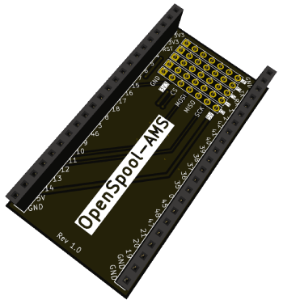
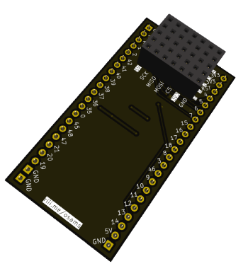

# OpenSpool AMS

This repository contains the PCB design for the [OpenSpool](https://github.com/spuder/OpenSpool) project. This PCB can connect up to 5 PN532 NFC reader modules to an ESP32 S3 WROOM devkit board.

  

## How to use

You can use this board on top, or on the bottom of your ESP32. Depending on which side you solder the female (or male) sockets (or pinheaders) you can then use the other side to connect your NFC readers to. The pins are in the same order as the pins on the PN532 board so you should be able to use dupont wires 6-wide (without tearing the wires apart). The wires should then go straight from this board to the PN532 module.

Note that the 'connectorblock' has an extra row of pins for 5 volts. You don't **need** to populate this. However, if for some reason your PN532 readers won't work you can try connecting the 3V3 wire to this 5V rail. Some PN532 reader modules apparently won't work on 3V3 (I haven't encountered them yet).

## What you need

* `1x` ESP32 S3 WROOM DEVKIT
* `2x` 22 pin female pin socket or pin header
* `6x` 5 pin female pin socket or pin header (`+1` if you want to populate the 5V one whilst also populating the 3V3 one)
* `1x per PN532 reader` 6 pin wide dupont wire male/female as you see fit

## Steps

1. Determine which side of the board you want to go on top or on the bottom of the ESP32. This is the side you solder the 22 pin female socket or pinheader to.
2. Solder the 6 (or 7) female sockets or pinheaders to the other side of this PCB so the wires won't have to be routed between the ESP32 and this board.
3. Connect the ESP32 to this board, hook up the PN532 modules to this board. Pay attention that you connect each board to a numbered column (`0` through `4`) and pay extra close attention the the 3V3 and 5V pins to ensure the correct ones go to VCC on the PN532 module.

For more instructions, or how to proceed after this, see the [OpenSpool project](https://github.com/spuder/OpenSpool).